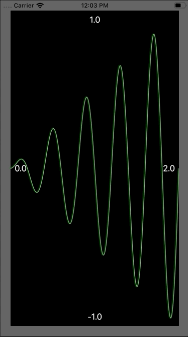

This is a simple application that illustrates how to render an XY plot in one coordinate system into a
CAShapeLayer path using the right CGAffineTransform to translate into UIView layer frame coordinates.
The application supports panning and zooming. Nothing fancy, just straightforward.

